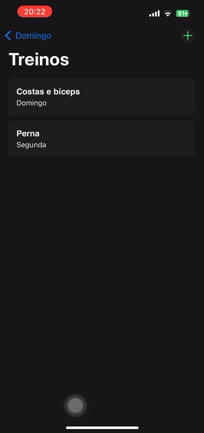

# Workout Tracking

## Description

This app allows you to easily create and manage your workouts, track exercises, and log your progress over time.

## Features

- Create Workouts: Build personalized workout routines with various exercises and sets.
- Track Sets & Reps: Record the number of reps for each set in your workout, helping you track progress and adjust as needed.
- Workout History: Keep a detailed history of completed workouts to monitor your improvements.

## Technologies Used

- Swift
- View Code
- Realm

<div>
  
  
</div>

## Getting Started

### Prerequisites

- Xcode installed on your machine.

### Installation

1. Clone the repository to your local machine.

```bash
git clone https://github.com/your-username/ios-todo-app.git
